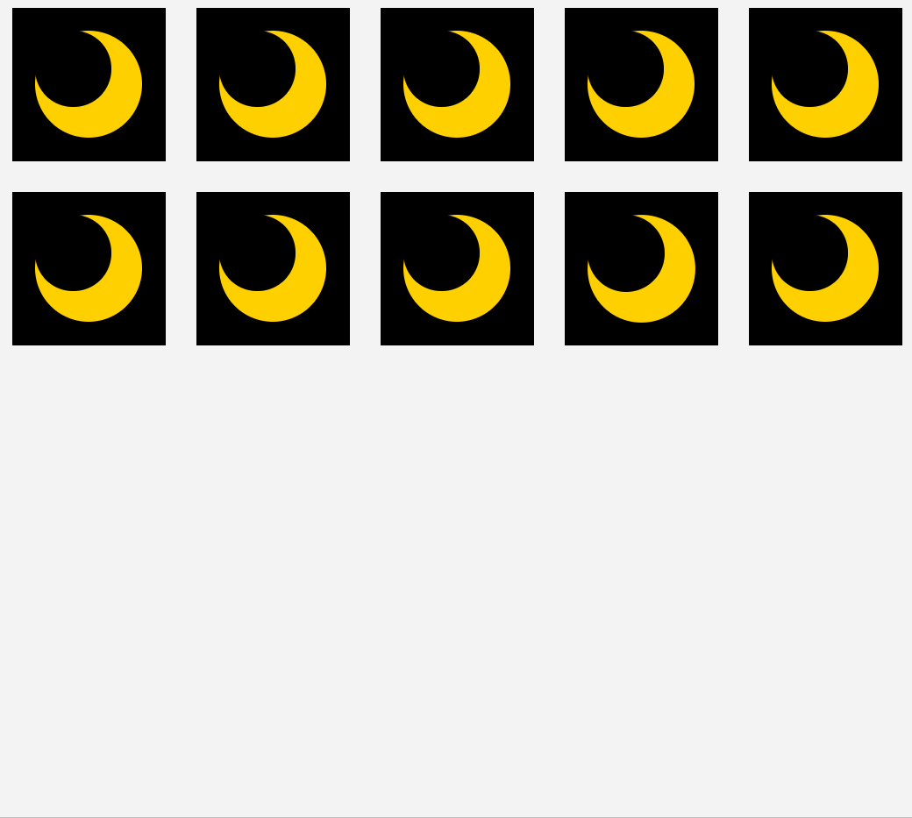

<p align="center">
  
</p>

# React Easy Flip

<center><b>A lightweight React library for smooth FLIP animations (2.3KB minified + gzipped)</b></center>

## Demo

https://demo.jlkiri.now.sh/

## Install

`npm install react-easy-flip`  
OR  
`yarn add react-easy-flip`

## Get started

The library consists of two independent hooks: `useSimpleFlip` and `useFlipGroup`. Use `useFlipGroup` if you need to animate position or size of an indefinite number of children (see examples below). Use `useSimpleFlip` for everything else.

1. Import `useSimpleFlip` hook:

```javascript
import { useSimpleFlip } from 'react-easy-flip'
```

OR

```javascript
const { useSimpleFlip } = require('react-easy-flip')
```

2. Pick a unique `id` and assign it to the element you want to animate
3. Use the hook by passing it the id and dependencies that you would normally pass to `useEffect` (e.g. an array that is used to render children):

```javascript
useSimpleFlip({ flipId: myId, flag: myDeps })
```

## Usage

### useSimpleFlip

`useSimpleAnimation` requires one argument, which is minimally an object with the `id` of your animated element and `boolean` hook [dependencies](https://reactjs.org/docs/hooks-reference.html#conditionally-firing-an-effect). You may optionally provide:

a) a callback to be executed after an animation is done: `onTransitionEnd`
b) CSS transition options
c) a special flag that tells the hook whether the transition is "shared"

|       Field       | Required |    Type    |                                      Details                                      |
| :---------------: | :------: | :--------: | :-------------------------------------------------------------------------------: |
|     `flipId`      |  `true`  |  `string`  | A React reference to a parent element which contains children you want to animate |
|      `flag`       |  `true`  | `boolean`  |                                 Hook dependencies                                 |
|      `opts`       | `false`  |  `object`  |                             Animation options object                              |
| `onTransitionEnd` | `false`  | `function` |               A callback to be executed after an animation is done                |
|    `isShared`     | `false`  | `boolean`  |       A special flag that tells the hook whether the transition is "shared"       |

### useFlipGroup

`useSimpleAnimation` requires one argument, which is minimally an object with the `id` of your animated element and hook [dependencies](https://reactjs.org/docs/hooks-reference.html#conditionally-firing-an-effect). Just like in `useSimpleFlip` you may optionally provide:

a) a callback to be executed after an animation is done: `onTransitionEnd`
b) CSS transition options

|       Field       | Required |    Type    |                                      Details                                      |
| :---------------: | :------: | :--------: | :-------------------------------------------------------------------------------: |
|     `flipId`      |  `true`  |  `string`  | A React reference to a parent element which contains children you want to animate |
|      `deps`       |  `true`  |   `any`    |                                 Hook dependencies                                 |
|      `opts`       | `false`  |  `object`  |                             Animation options object                              |
| `onTransitionEnd` | `false`  | `function` |               A callback to be executed after an animation is done                |

### Options in detail

You may add an `opts` options object to the argument of `useSimpleFlip` or `useFlipGroup`. It allows you to specify CSS transition duration, easing function and animation delay:

|    Field     | Default  |   Type   |                     Details                     |
| :----------: | :------: | :------: | :---------------------------------------------: |
| `transition` |  `700`   | `number` |      Transition duration (in milliseconds)      |
|   `easing`   | `"ease"` | `string` | Animation easing function (any valid CSS value) |
|   `delay`    |   `0`    | `number` |        Animation delay (in milliseconds)        |

Usage example:

```javascript
const opts = {
  transition: 200,
  easing: 'cubic-bezier(0.39, 0.575, 0.565, 1)',
  delay: 300
}

useSimpleFlip({ flipId: 'uniqueId', opts, flag: isClicked })
```

## Comparison with other libraries

Among similar libraries such as [`react-overdrive`](https://github.com/berzniz/react-overdrive), [`react-flip-move`](https://github.com/joshwcomeau/react-flip-move) or [`react-flip-toolkit`](https://github.com/aholachek/react-flip-toolkit) that are based on a [FLIP technique](https://aerotwist.com/blog/flip-your-animations/), this library's capabilities match those of `react-flip-toolkit`.

`react-easy-flip` can animate both position and scale, as well as prevent distortion of children of an animated element when its scale is changed. It also allows you to easily do so-called ["shared element transitions"](https://guides.codepath.com/android/shared-element-activity-transition) (e.g. smoothly translate an element from one page to another). The examples are given below.

Additionally, `react-easy-flip` is the **only** FLIP library for React that provides animation via a hook. `react-easy-flip` has the **smallest bundle size**. It does not use React class components and lifecycle methods that are considered unsafe in latest releases of React.

## Examples

The code for the demo above can be found in this repository [here](https://github.com/jlkiri/react-easy-flip/tree/master/demo).
Below are some simple Codesandbox examples:

### Translate and scale (with child scale adjustment)

This examples shows the difference between the same transition done in CSS and with `react-easy-flip`:

https://codesandbox.io/s/css-vs-js-child-warping-t7f95


### Shuffle children

This is a good usecase for `useFlipGroup`:

https://codesandbox.io/s/list-shuffling-flip-hlguz


### Shared element transition

This is an example of so-called shared element transition. Click on any square with the Moon in it. Note that the black background and the Moon are different elements (with different parents) after the click, yet the animation remains smooth despite the DOM unmount.

https://codesandbox.io/s/shared-element-transition-flip-9orsy



## Tips

- You may need to think about how you structure your HTML before you try to "customize" animations with your own CSS (it will probably not work)
- `useFlipGroup` is best used with a `transitionend` callback: disable animation-triggering actions until animation is finished to prevent possible layout problems
- It is possible to use more than one instance of each hooks within one React component but make sure to:
  a) Keep `id`s unique
  b) Avoid making one `id` a target for more than one animation

## Requirements

This library requires React version 16.8.0 or higher (the one with Hooks).

## Done in 3.0

- [x] Full Typescript support
- [x] Add support for animating scale and shared element transitions
- [x] Add comprehensive examples
- [x] Add tests
